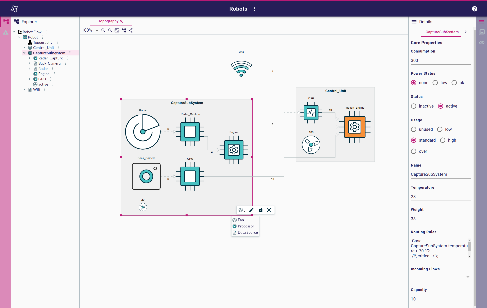

= Eclipse Sirius Web

https://www.eclipse.org/sirius/sirius-web.html[Eclipse Sirius Web] is a framework to easily create and deploy studios to the web.
We keep the principles which made the success of https://www.eclipse.org/sirius[Eclipse Sirius Desktop] and make them available on a modern cloud-based stack.

image::rasa.gif

This repository, `sirius-web`, contains an example application of the Sirius Web platform, built using the frontend and backend components in https://github.com/eclipse-sirius/sirius-components[`sirius-components`].

To test _Sirius Web_ you have two possible options:

. If you just want to run an already built version of the example application, follow link:#quick-start[the Quick Start].
. If you want to _build_ the example application yourself, follow link:#build[the complete Build instructions].

[#quick-start]
== Quick Start

If you want a quick overview of how Sirius Web looks and feels like without building the sample application yourself, you will simply need:

* Java 11 (Java 12 or later are currently not supported)
* Docker, or an existing PostgreSQL 12 (or later) installation with a DB user that has admin rights on the database (those are needed by the application to create its schema on first startup).

Then, download the latest pre-built JAR:

. Go to https://github.com/eclipse-sirius/sirius-web/actions?query=workflow%3A%22Build+and+Publish+Sample+Application%22[the "Build and Publish Sample Application" workflow page].
. Click on the last successful job (the most recent with a green checkmark).
. Click on the `SiriusWebSample` artifact.
This will download a `SiriusWebSample.zip` archive.
. Unzip the archive once it has been downloaded.

Inside the zip archive you will get a single "fat JAR" named `sirius-web-sample-application.jar` which contains the complete sample application with all its dependencies.

To actually run the application:

1. Sirius Web uses PostgreSQL for its database. For development or local testing, the easiest way is to start a PostgreSQL instance using Docker.
+
[source,sh]
----
docker run -p 5433:5432 --rm --name sirius-web-postgres \
                             -e POSTGRES_USER=dbuser \
                             -e POSTGRES_PASSWORD=dbpwd \
                             -e POSTGRES_DB=sirius-web-db \
                             -d postgres:12
----
+
WARNING: This may take a while the first time you run this as Docker will first pull the PostgreSQL image.
+
If you do not have Docker or want to use an existing PostgreSQL installation, adjust the command-line parameters below and make sure the DB user has admin rights on the database; they are needed to automatically create the DB schema.
2. Start the application:
+
[source,sh]
----
java -jar sirius-web-sample-application.jar \
          --spring.datasource.url=jdbc:postgresql://localhost:5433/sirius-web-db \
          --spring.datasource.username=dbuser \
          --spring.datasource.password=dbpwd \
          --spring.liquibase.change-log=classpath:db/changelog/sirius-web.db.changelog.xml
----
3. Point your browser at http://localhost:8080 and enjoy!
+
WARNING: The initial version of Sirius Web has some known issues with Firefox.
It is recommended to use a Chrome-based browser until these are fixed.

NOTE: Do not forget to stop the PostgreSQL container once you are done: `docker kill sirius-web-postgres`. 
Note that this will remove all the data you have created while testing the application.

[#build]
== Building

[#build-requirements]
=== Requirements

To build the example application yourself you will need the following tools:

* Git, and a GitHub account
* To build the frontend:
** Recent versions of https://nodejs.org/[Node and NPM]: in particular, Node >= 16.6 is required along with npm >= 7.20.
** https://rollupjs.org/[rollup] (`npm install -g rollup`)
** https://github.com/whitecolor/yalc[yalc] (`npm install -g yalc`)
* To build the backend:
** Java 11 (Java 12 or later are currently not supported)
** https://maven.apache.org[Apache Maven 3.6.3]

WARNING: Note that there are issues with npm under Windows Subsystem for Linux (WSL). If you use WSL and encounter error messages like _"Maximum call stack size exceeded"_ when running NPM, switch to plain Windows where this should work.

[#github-token]
=== GitHub Access Token

The backend part of _Sirius Components_ depends on https://github.com/eclipse-sirius/sirius-emf-json[`sirius-emf-json`], which is published as Maven artifacts in _GitHub Packages_.
To build `sirius-components` locally, you need a _GitHub Access Token_ so that Maven can download the `sirius-emf-json` artifacts.

. Create a personal token with a scope of `read:package` by following https://docs.github.com/en/free-pro-team@latest/github/authenticating-to-github/creating-a-personal-access-token[the GitHub documentation] if you do not have one already.
+
WARNING: Once generated, a token cannot be displayed anymore, so make sure to copy it in a secure location.
. Create or edit `$HOME/.m2/settings.xml` to tell Maven to use this token when accessing the Sirius EMF JSON repository:
+
[source,xml]
----
<?xml version="1.0" encoding="UTF-8"?>
<settings xmlns="http://maven.apache.org/SETTINGS/1.0.0"
          xmlns:xsi="http://www.w3.org/2001/XMLSchema-instance"
          xsi:schemaLocation="http://maven.apache.org/SETTINGS/1.0.0 https://maven.apache.org/xsd/settings-1.0.0.xsd">
  <servers>
    <server>
      <id>github-sirius-emfjson</id>
      <username>$GITHUB_USERNAME</username>
      <password>$GITHUB_ACCESS_TOKEN</password>
    </server>
    <server>
      <id>github-sirius-components</id>
      <username>$GITHUB_USERNAME</username>
      <password>$GITHUB_ACCESS_TOKEN</password>
    </server>
    <server>
      <id>github-flow</id>
      <username>$GITHUB_USERNAME</username>
      <password>$GITHUB_ACCESS_TOKEN</password>
    </server>
  </servers>
</settings>
----
+
Be sure to replace `$GITHUB_USERNAME` with your GitHub user id, and `$GITHUB_ACCESS_TOKEN` with the value of your acess token.
+
IMPORTANT: The `id` used in your `settings.xml` *must* be the ones mentioned above to match what is used in the POMs.
. Create or edit `$HOME/.npmrc` and add the following line:
+
----
//npm.pkg.github.com/:_authToken=$GITHUB_ACCESS_TOKEN
----
+Again, be sure to replace `$GITHUB_ACCESS_TOKEN` with the value of your acess token.

[#build-steps]
=== Build steps

Build steps:

1. Clone the Sirius Web repository:
+
[source,sh]
----
git clone https://github.com/eclipse-sirius/sirius-web.git
cd sirius-web
----
2. Build the frontend.
From the `frontend` directory:
+
[source,sh]
----
npm ci
npm run build
----
3. Install the frontend artifacts as static resource to be served by the backend.
From the root directory of the repository:
+
[source,sh]
----
mkdir -p backend/sirius-web-frontend/src/main/resources/static
cp -R frontend/build/* backend/sirius-web-frontend/src/main/resources/static
----
4. Build the backend.
From the `backend` directory:
+
[source,sh]
----
mvn clean package
----
+
The result is a ready-to-run, Spring Boot "fat JAR" in `backend/sirius-web-sample-application/target/sirius-web-sample-application-0.0.1-SNAPSHOT.jar`.
Refer to the instructions in the "Quick Start" section above to launch it.

== License

Everything in this repository is Open Source. Except when explicitly mentioned otherwise (e.g. for some resources likes images), the license is Eclipse Public License - v 2.0.
